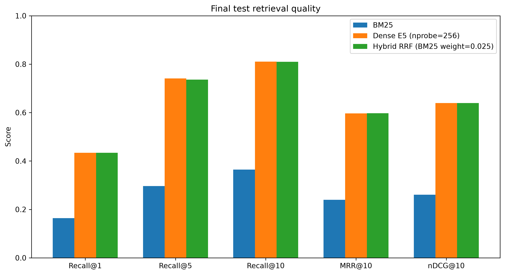
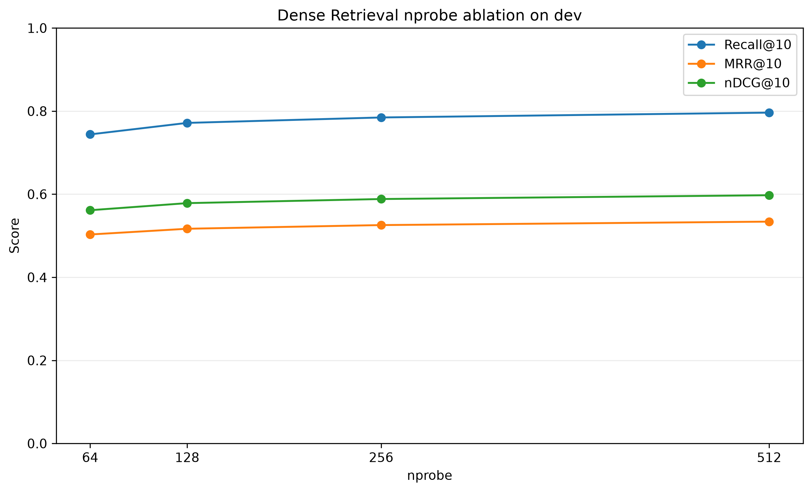
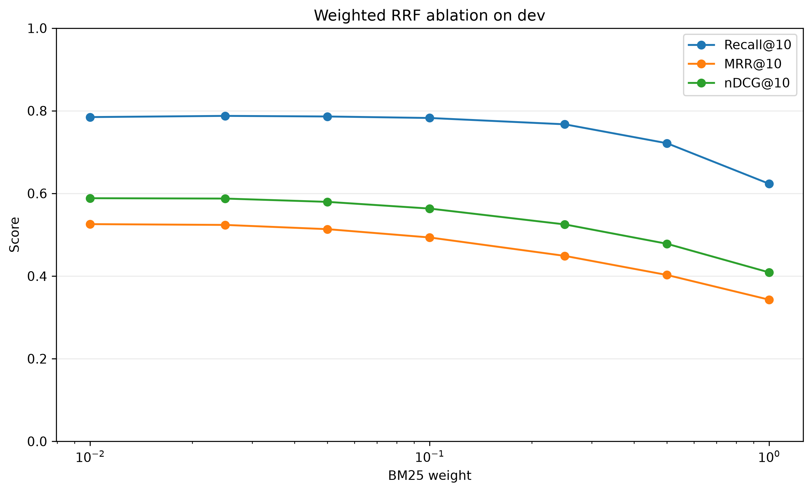
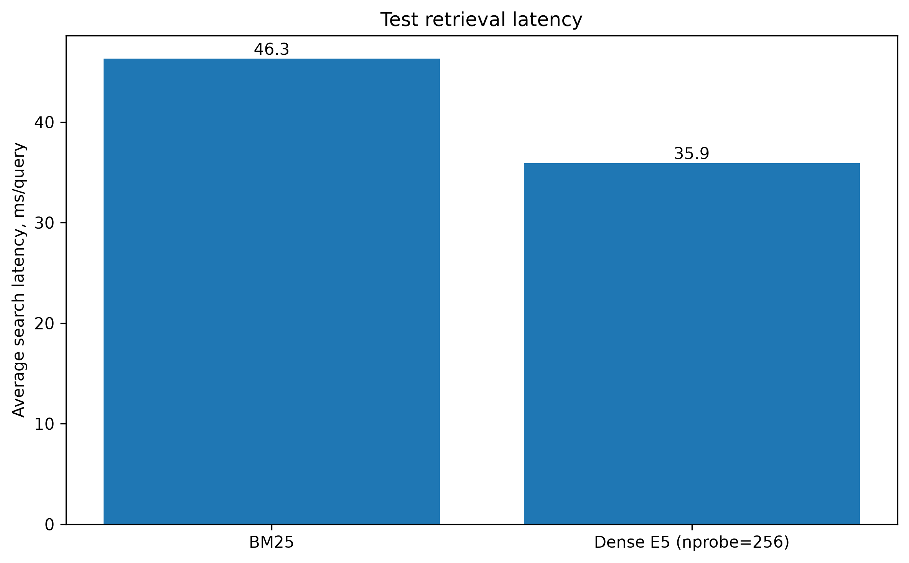
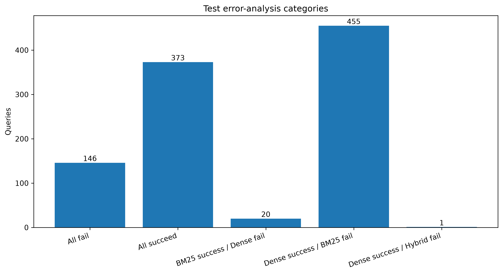

# RAG Retrieval Research

Исследование методов извлечения русскоязычных документов для Retrieval-Augmented Generation (RAG).

Экспериментальная часть исследования завершена. В репозитории реализованы и сопоставлены:

- **BM25** — классический разреженный лексический поиск;
- **Dense Retrieval** — `intfloat/multilingual-e5-small` + FAISS;
- **Hybrid Retrieval** — weighted Reciprocal Rank Fusion (RRF);
- ablation по `nprobe` для Dense Retrieval;
- ablation по весу BM25 для Hybrid Retrieval;
- независимая финальная оценка на `test`;
- качественный error analysis;
- агрегированные итоговые таблицы и графики.

## Research question

Какой из рассматриваемых методов обеспечивает наиболее высокое качество извлечения релевантных русскоязычных документов при одинаковых условиях эксперимента?

## Hypothesis

Hybrid Retrieval может превосходить отдельные retriever-ы за счёт объединения лексических и семантических сигналов.

По результатам эксперимента гипотеза подтверждается только частично: Hybrid даёт небольшое улучшение отдельных метрик, однако устойчивого превосходства над Dense Retrieval не обнаружено.

## Dataset and experimental protocol

Используется русскоязычная часть **Mr. TyDi**.

- корпус: **9 597 504 документа**;
- используются `train`, `dev` и `test`;
- параметры методов выбирались только по `dev`;
- после выбора конфигурации параметры фиксировались;
- `test` использовался для независимой финальной оценки и не применялся для дополнительного tuning;
- финальный `test` содержит **995 запросов**.

## Experimental environment

Эксперименты выполнялись локально на Apple Silicon:

- MacBook Air;
- Apple M4;
- 16 GB unified memory;
- macOS;
- PyTorch MPS для Dense Retrieval;
- Python 3.12.

Эти характеристики следует учитывать при интерпретации приведённых измерений времени выполнения. Абсолютные latency и throughput зависят от оборудования и программного окружения.

## Methods

### BM25

Финальная конфигурация:

- `bm25s`;
- Lucene BM25;
- `k1 = 1.2`;
- `b = 0.75`;
- русский Snowball stemmer;
- документ: `title + " " + text`;
- top-100.

### Dense Retrieval

Финальная конфигурация:

- модель: `intfloat/multilingual-e5-small`;
- embedding dimension: **384**;
- документы: `passage: <title> <text>`;
- запросы: `query: <text>`;
- normalized embeddings;
- FAISS `IVFScalarQuantizer`;
- SQ8;
- inner product;
- `nlist = 2048`;
- `nprobe = 256`;
- top-100.

Полный индекс занимает около **3.5 GB**. Peak RSS при его построении составлял около **3.74 GiB**, скорость кодирования полного корпуса — около **92.64 docs/s**.

### Hybrid Retrieval

Dense и BM25 объединяются методом weighted Reciprocal Rank Fusion:

```text
score(d) =
w_BM25 / (k + rank_BM25(d))
+
w_Dense / (k + rank_Dense(d))
```

Финальная конфигурация:

- `k = 60`;
- BM25 top-100;
- Dense top-100;
- Dense `nprobe = 256`;
- `w_Dense = 1.0`;
- `w_BM25 = 0.025`;
- Hybrid top-100.

## Final test results

| Метод | Recall@1 | Recall@5 | Recall@10 | MRR@10 | nDCG@10 |
| --- | ---: | ---: | ---: | ---: | ---: |
| BM25 | 0.164154 | 0.296650 | 0.364824 | 0.239390 | 0.260872 |
| Dense E5, nprobe=256 | 0.434003 | **0.741039** | **0.810553** | 0.596679 | 0.639182 |
| Hybrid RRF, w_BM25=0.025 | **0.434171** | 0.736013 | 0.809548 | **0.597441** | **0.639626** |



Dense Retrieval существенно превосходит BM25. Dense и Hybrid показывают почти одинаковое качество: Hybrid немного лучше по Recall@1, MRR@10 и nDCG@10, тогда как Dense немного лучше по Recall@5 и Recall@10.

## Dense nprobe ablation

Ablation проводился на `dev`.

| nprobe | Recall@1 | Recall@5 | Recall@10 | MRR@10 | nDCG@10 |
| ---: | ---: | ---: | ---: | ---: | ---: |
| 64 | 0.380364 | 0.670545 | 0.744000 | 0.503056 | 0.561469 |
| 128 | 0.388364 | 0.688000 | 0.771636 | 0.516823 | 0.578498 |
| 256 | 0.394909 | 0.701818 | 0.784727 | 0.525663 | 0.588376 |
| 512 | 0.401455 | 0.713455 | 0.796364 | 0.533988 | 0.597516 |



Для финального эксперимента заранее зафиксирован `nprobe=256` как рабочий компромисс между качеством и вычислительной стоимостью.

## Hybrid weight ablation

Ablation проводился на `dev` при `w_Dense=1.0` и `k=60`.

| BM25 weight | Recall@1 | Recall@5 | Recall@10 | MRR@10 | nDCG@10 |
| ---: | ---: | ---: | ---: | ---: | ---: |
| 1.000 | 0.234182 | 0.482909 | 0.623273 | 0.342751 | 0.408833 |
| 0.500 | 0.276364 | 0.570182 | 0.721455 | 0.402610 | 0.478109 |
| 0.250 | 0.309818 | 0.642182 | 0.767273 | 0.448812 | 0.525000 |
| 0.100 | 0.351273 | 0.691636 | 0.782545 | 0.493373 | 0.563325 |
| 0.050 | 0.377455 | 0.698909 | 0.786182 | 0.513499 | 0.579554 |
| 0.025 | 0.392727 | **0.704000** | **0.787636** | 0.523740 | 0.587544 |
| 0.010 | 0.394909 | 0.701818 | 0.784727 | 0.525663 | 0.588376 |



При увеличении вклада BM25 качество Hybrid заметно ухудшается. Лучшие конфигурации находятся близко к Dense Retrieval, то есть лексический сигнал оказывается полезен только при небольшом весе.

## Retrieval latency

На финальном `test`:

- BM25 retrieval: около **46.3 мс/запрос**;
- Dense FAISS search (`nprobe=256`): около **35.9 мс/запрос**;
- кодирование 995 Dense-запросов: около **2.34 с**.



Значения отражают конкретное локальное экспериментальное окружение и не являются универсальным benchmark оборудования.

## Qualitative error analysis

Error analysis выполнен на тех же **995 test-запросах** при cutoff `@10`.

Основные категории:

- все три метода успешны: **373**;
- все три метода не находят релевантный документ в top-10: **146**;
- Dense успешен, BM25 неуспешен: **455**;
- BM25 успешен, Dense неуспешен: **20**;
- Dense успешен, Hybrid неуспешен: **1**.

При прямом сравнении Dense и Hybrid:

- Hybrid лучше Dense: **58 запросов**;
- Dense лучше Hybrid: **48 запросов**;
- результат одинаков: **889 запросов**.



Это подтверждает количественные результаты: Hybrid способен менять ранги в обе стороны, но для подавляющего большинства запросов практически повторяет Dense. Отдельно остаётся небольшой класс запросов, где лексический BM25 находит релевантный документ, пропущенный Dense, однако выбранный небольшой вес BM25 недостаточен, чтобы систематически переносить это преимущество в Hybrid top-10.

Подробный анализ: [docs/error-analysis.md](docs/error-analysis.md).

## Main findings

1. **Dense Retrieval значительно превосходит BM25** на рассматриваемой русскоязычной части Mr. TyDi.
2. `multilingual-e5-small` обеспечивает сильный retrieval baseline даже при компактной размерности embeddings.
3. Увеличение `nprobe` последовательно улучшает качество Dense Retrieval на `dev`, но увеличивает вычислительную стоимость.
4. Наивный Hybrid с равными весами существенно хуже Dense.
5. Снижение веса BM25 позволяет Hybrid приблизиться к Dense.
6. Финальный Hybrid немного улучшает Recall@1, MRR@10 и nDCG@10, но немного уступает Dense по Recall@5 и Recall@10.
7. **Устойчивого превосходства Hybrid над Dense не обнаружено.**
8. Качественный анализ подтверждает, что BM25 и Dense имеют отдельные взаимодополняющие случаи, однако простой weighted RRF не полностью реализует этот потенциал.

## Reproducibility and artifacts

Итоговые агрегированные результаты находятся в:

```text
results/final/
```

Основные артефакты:

- `final_results.json` — агрегированные параметры и результаты;
- `test_comparison.csv`;
- `dev_comparison.csv`;
- `dense_nprobe_ablation.csv`;
- `hybrid_weight_ablation.csv`;
- `latency_summary.csv`;
- `error_analysis_summary.csv`;
- `figures/` — PNG/PDF версии итоговых графиков.

Скрипты:

```text
src/build_final_results.py
src/build_final_plots.py
src/analyze_errors.py
```

Все отслеживаемые итоговые артефакты используют repository-relative paths; локальные абсолютные пути в финальные результаты не включаются.

## Research status

Экспериментальная часть завершена:

- [x] подготовка данных;
- [x] BM25 baseline;
- [x] Dense Retrieval;
- [x] Dense `nprobe` ablation;
- [x] Hybrid Retrieval;
- [x] Hybrid weight ablation;
- [x] выбор и фиксация конфигураций по `dev`;
- [x] независимая финальная оценка на `test`;
- [x] qualitative error analysis;
- [x] агрегирование итоговых результатов;
- [x] итоговые таблицы;
- [x] publication-ready figures.

**Следующий этап — подготовка и написание исследовательской статьи.**
